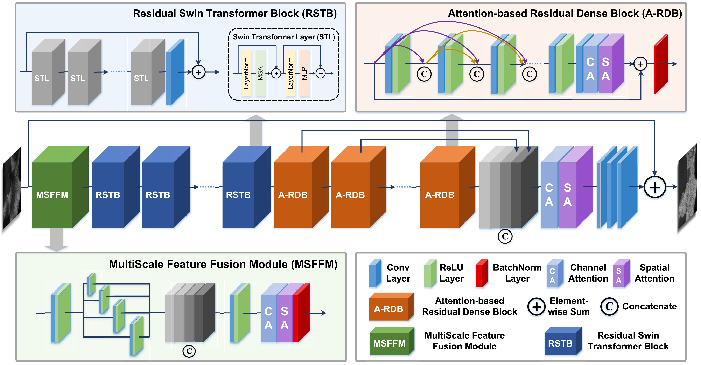
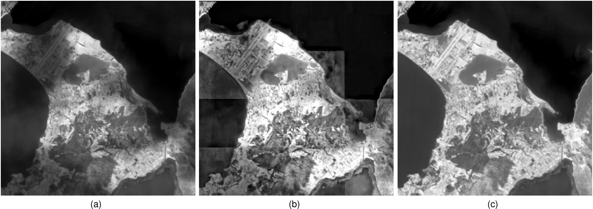

# MRF-Net

MRF-Net: An Infrared Remote Sensing Image Thin Cloud Removal Method With the Intra-Inter Coherent Constraint

> [Paper Link](https://ieeexplore.ieee.org/abstract/document/10706118)


## Model Architecture

The architecture of MRF-Net is designed to efficiently remove thin clouds from infrared remote sensing images. 




## Model Results

The following figure shows the results of applying the proposed method on an infrared remote sensing image containing thin clouds.

- (a) Input infrared remote sensing image with thin cloud.
- (b) Thin cloud removal result using the existing method.
- (c) Thin cloud removal result using the proposed MRF-Net.




## Citation

```
@article{xu2024mrf,
title={MRF-Net: An Infrared Remote Sensing Image Thin Cloud Removal Method with the Intra-inter Coherent Constraint},
author={Xu, Qizhi and Chen, Jiuchen and Yan, Xinyu and Li, Wei},
journal={IEEE Transactions on Geoscience and Remote Sensing},
year={2024},
publisher={IEEE}
}
```
